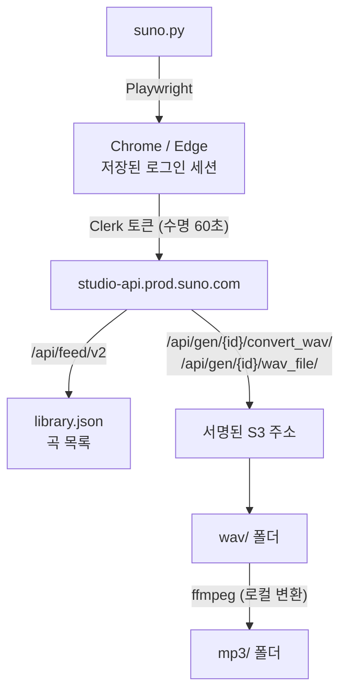

# 기술 노트 — Suno API 동작과 우회 방법

이 도구가 왜 지금과 같은 구조인지, 그리고 Suno 쪽에서 무엇이 막혔고 어떻게
돌아가는지 정리한 문서입니다. 나중에 동작이 깨졌을 때 여기서부터 확인하세요.

> 조사 시점: **2026년 8월 30일**
> Suno 는 예고 없이 API 를 바꿉니다. 아래 내용이 맞지 않으면 이 문서를 갱신해 주세요.

<br>

## 1. 전체 흐름



핵심은 **목록과 파일을 분리**한 점입니다. 목록 API 는 브라우저 세션이 필요하지만,
실제 오디오는 서명된 주소나 CDN 에서 인증 없이 받을 수 있습니다.

<br>

## 2. 실행하면 무슨 일이 벌어지나

`SunoDownloader.exe` 또는 `run.bat` 을 인자 없이 실행하면 아래가 순서대로 돈다.
**순서가 중요하다.** 바꾸면 서로 충돌한다.

```
1. 로그인 확인      프로필이 없으면 브라우저를 띄워 로그인, 세션 만료면 다시 로그인
2. 목록 동기화      Liked 곡을 받아 library.json 저장
                   번호를 created_at 순위로 다시 매김 (가장 오래된 곡이 1번)
3. 사라진 곡 치우기  서버 목록에 없는 곡의 로컬 파일을 _removed/ 로 이동
4. 이름 맞추기      제목·번호가 바뀐 파일을 새 이름으로 (2단계 rename)
5. 수동 파일 받기    wav/ 에 직접 넣어둔 파일을 곡에 연결, 이름 정리, MP3 변환
6. 웹 UI 열기       127.0.0.1:8777
```

### 왜 이 순서인가

- **3 이 4 보다 먼저** — 좋아요를 해제한 곡의 파일이 옛 번호를 달고 남아 있으면,
  그 번호를 새로 받은 곡이 이름을 못 바꾼다. 먼저 비켜 줘야 한다.
- **4 가 5 보다 먼저** — 5 는 기록에 없는 파일만 다룬다. 4 에서 기록에 있는
  파일을 모두 제자리로 옮겨 놓아야 5 가 남은 것만 정확히 집어낸다.
- **2 에서 번호를 매번 다시 계산** — 상태를 저장하지 않으므로 어느 PC 에서
  실행해도 같은 번호가 나온다.

<br>

## 3. 다른 PC 에 옮기기

번호가 `created_at` 순위로 계산되므로, 같은 Liked 목록이면 **어느 PC 에서든
같은 번호**가 나온다. 그래서 음원만 옮기면 나머지는 저절로 맞는다.

```
1. wav/ 와 mp3/ 폴더를 통째로 복사          ← downloaded.json 도 함께
2. 새 PC 에서  git clone <저장소>
3. 복사해 온 wav/ 와 mp3/ 를 그 폴더에 넣기
4. run.bat 실행  → 브라우저가 뜨면 Suno 로그인 (그 PC 에서 1회)
```

이후로는 위 1-1 흐름이 자동으로 돌면서 이름·기록·MP3 를 맞춘다.

- **`downloaded.json` 을 빠뜨려도 복구된다.** 5단계가 제목과 재생 길이로 곡을
  찾아 이름을 맞추고 기록을 새로 만든다. 다만 MP3 를 전부 다시 변환하므로
  기록을 함께 옮기는 편이 훨씬 빠르다.
- **음원을 안 옮기고 clone 만 하면** 프로그램은 돌지만 전곡을 처음부터 받으려
  한다. 용량도 크고, 9/3 이후에는 WAV 생성 요청이 한도에 걸린다. 권하지 않는다.
- 로그인 세션(`.chrome-profile/`)은 옮기지 않는다. PC 마다 새로 로그인한다.

<br>

## 3-1. Python 을 못 찾을 때

`run.bat` 은 세 곳을 순서대로 본다. PATH 에 없어도 설치만 돼 있으면 찾는다.

1. `python` — PATH 에 등록된 것
2. `py -3` — 런처. python 이 PATH 에 없어도 대개 이건 있다
3. `%LOCALAPPDATA%\Programs\Python\Python3*`, `%ProgramFiles%\Python3*`,
   `%ProgramFiles(x86)%\Python3*` 안의 `python.exe`

셋 다 없으면 설치 안내를 띄운다. 이때 `%LOCALAPPDATA%\Microsoft\WindowsAppspython.exe` 가 있으면 **Microsoft Store 연결용 가짜 실행 파일**이 가로채는
상황이므로 앱 실행 별칭을 끄라고 따로 알려준다. 이 파일은 실행하면 스토어를
열 뿐이라 `--version` 이 실패한다.

Python 을 설치할 수 없는 PC 라면 `build.bat` 으로 만든 `SunoDownloader.exe` 와
`_internal/` 을 복사해 가면 된다. Python 없이 돈다.

 — 호스트 세 군데

전부 Suno 것이지만 열려 있는 정도가 다릅니다.

| 호스트 | 정체 | 상태 (2026-08-30) |
|:--|:--|:--|
| `cdn1.suno.ai` | Suno 파일 서버 | **MP3 차단됨 (403)** · 예전 WAV 는 열림 |
| `d2lwuy8qc234o3.cloudfront.net` | Suno 가 쓰는 AWS 배포망 | m4a 열림 — **단, 암호화돼 있어 못 씀** |
| `suno-data-uploads.s3.amazonaws.com` | Suno S3 저장소 | WAV — 서명된 주소로만 |

<br>

## 5. 곡 목록 가져오기

```
GET /api/feed/v2?is_liked=true&page=0
Authorization: Bearer <Clerk 토큰>
```

- 서버측 `is_liked=true` 필터가 동작합니다. 안 되면 전체를 훑어 직접 거릅니다.
- 페이지당 20곡. 새 곡이 없는 페이지가 두 번 연속이면 끝으로 봅니다.
- **Clerk 토큰은 수명이 60초**입니다. 그래서 목록만 브라우저에서 가져오고
  다운로드는 브라우저 밖에서 합니다.

### 응답에서 주의할 필드

**`audio_url` 은 더 이상 쓸 수 없습니다.**

```json
"audio_url": "https://studio-api.prod.suno.com/api/forbidden"
```

전 곡이 이 값입니다. 실제 주소는 `media_urls` 배열에 있습니다.

```json
"media_urls": [
  { "url": "https://d2lwuy8qc234o3.cloudfront.net/1/clip/{id}.m4a",
    "content_type": "m4a-opus", "encoding": "1.0.0" },
  { "url": "https://cdn1.suno.ai/{id}.mp3", "content_type": "mp3" }
]
```

`image_url` 은 그대로 씁니다. **곡 id 로 주소를 유추하면 안 됩니다** —
커버를 교체한 곡은 곡 id 와 무관한 별도 UUID 를 쓰고 `image_` 접두사도 없습니다.
조사 당시 766곡 중 379곡이 여기 해당했습니다.

<br>

## 6. WAV — 미리 만들어져 있지 않습니다

Suno 는 곡을 만들 때 WAV 를 생성해 두지 않습니다. **누군가 다운로드를 한 번
눌러야** 그때 변환됩니다. 그래서 한 번도 받은 적 없는 곡은 `403` 이 돌아옵니다.

```
POST /api/gen/{id}/convert_wav/     -> 204   변환 요청
GET  /api/gen/{id}/wav_file/        -> 200   {"wav_file_url": "..."}
```

- 변환은 보통 **6초** 안팎, 곡이 몰리면 더 걸립니다.
- 아직 안 만들어졌으면 `wav_file` 이 `{}` 를 돌려줍니다. 주소가 나올 때까지
  3초 간격으로 확인합니다 (최대 약 2분).
- 돌아오는 주소는 **서명된 S3 링크**입니다. 만료 시각이 있으니 받아두려면
  바로 내려받아야 합니다.

```
https://suno-data-uploads.s3.amazonaws.com/studio/uploads/{id}.wav
    ?AWSAccessKeyId=...&Signature=...&Expires=...
```

> 이 서명은 **GET 전용**입니다. HEAD 로 크기를 미리 잴 수 없으므로
> `Content-Length` 검사 없이 받습니다.

새 곡의 WAV 는 `cdn1.suno.ai` 에 올라오지 **않습니다.** 예전처럼
`cdn1.suno.ai/{id}.wav` 를 넘겨짚으면 영원히 403 입니다.

<br>

## 7. MP3 — 서버에서 받지 않고 직접 만듭니다

MP3 를 받을 길이 사실상 없습니다.

| 시도 | 결과 |
|:--|:--|
| `cdn1.suno.ai/{id}.mp3` | **403** (전 곡, 예전에 받아지던 곡 포함) |
| `media_urls` 의 mp3 항목 | 같은 cdn1 주소 → 403 |
| CloudFront `.mp3` 경로들 | 400 / 404 |
| CloudFront `.m4a` | 200 으로 받히지만 **암호화된 데이터** |

m4a 가 특히 함정입니다. HTTP 200 에 3.4MB 라 받아진 것처럼 보이지만:

```
파일 앞부분   : \x1bZ\xc9\x8a...   (정상 MP4 라면 ftyp)
컨테이너 표식 : ftyp/moov/mdat 전부 없음
바이트 엔트로피: 7.999 / 8.0       (암호화·압축된 데이터)
```

재생되지 않습니다. **다운로드 성공 여부만 보고 내용을 확인하지 않으면 놓칩니다.**

### 그래서 로컬 변환

무손실 WAV 를 갖고 있으니 거기서 만듭니다.

```
ffmpeg -i <원본.wav> -vn -c:a libmp3lame -b:a 192k -f mp3 <결과.mp3>
```

- Suno 원본 MP3 가 **약 180 kbps** 라 192k 로 맞췄습니다.
- 임시 파일이 `.mp3.part` 로 끝나 ffmpeg 이 형식을 못 알아채므로
  **`-f mp3` 를 반드시 붙여야** 합니다. 없으면
  `Error opening output files: Invalid argument` 로 실패합니다.
- ffmpeg 은 시스템에 있으면 그걸, 없으면 `imageio-ffmpeg` 가 받아둔 것을 씁니다.

**부수 효과가 좋습니다.** Suno 를 거치지 않으므로 다운로드 한도와 무관하고,
서버 왕복도 곡당 한 번으로 줄었습니다.

<br>

## 8. 브라우저 자동화에서 겪은 것들

### 페이지 이동에 스크립트가 죽는다

```
Execution context was destroyed, most likely because of a navigation.
```

suno.com 은 SPA 라 첫 화면이 뜬 뒤 내부적으로 한 번 더 이동합니다. 그때 목록
수집 스크립트가 돌고 있으면 실행 문맥이 통째로 날아갑니다. **타이밍 문제라
어떤 PC 에서는 잘 되고 어떤 PC 에서는 매번 죽습니다.**

→ `Clerk.loaded` 를 기다려 화면이 가라앉은 뒤 실행하고, 걸리면 재시도합니다.

### 브라우저를 못 붙잡는 PC 가 있다

Playwright 기본 방식(`--remote-debugging-pipe`)이 통하지 않는 환경이 있습니다.
→ 실패하면 직접 `--remote-debugging-port` 로 띄우고 CDP 로 붙습니다.

### 강제 종료하면 로그인이 날아간다

직접 띄운 브라우저를 죽이면 Chrome 이 쿠키를 디스크에 쓰기 전에 끝납니다.
→ 반드시 `Browser.close()` 로 정상 종료시키고 프로세스가 끝날 때까지 기다립니다.

### 첫 접속이 느리다

길게 한 번 기다리면 화면이 `about:blank` 인 채로 멈춰 보여 사용자가 닫아버립니다.
→ 20초씩 5회로 나누고 진행 상황을 표시합니다.

<br>

## 9. 사내망에서 전부 실패할 때

```
[SSL: CERTIFICATE_VERIFY_FAILED] Missing Authority Key Identifier
```

Python 3.13 부터 `create_default_context()` 가 RFC 5280 엄격 검증
(`VERIFY_X509_STRICT`) 을 기본으로 켭니다. 그런데 사내망·백신의 SSL 검사 장비는
인증서를 즉석에서 재발급하면서 Authority Key Identifier 를 넣지 않는 경우가
많습니다. **브라우저는 멀쩡한데 Python 만 전부 실패합니다.**

→ 체인·호스트명 검증은 그대로 두고 이 엄격 검사만 끕니다 (`download.py`).

<br>

## 10. 파일 관리 규칙

### 번호는 만든 날짜 순위

`created_at` 오름차순으로 1번부터 매깁니다. 가장 오래된 곡이 1번입니다.

**순위로 정의했기 때문에 어느 PC 에서 계산해도 같은 번호가 나옵니다.**
회사 PC 에서 음원 폴더만 받아 실행해도 이름이 저절로 맞춰집니다.

대신 곡이 중간에서 빠지면(좋아요 해제) 그 뒤 번호가 한 칸씩 당겨져 파일
이름이 대량으로 바뀝니다. 이름 맞추기가 자동이라 문제는 없지만, 파일이
많으면 시간이 걸립니다.

### 생성 시각이 같은 곡의 순서

`created_at` 이 밀리초까지 똑같은 곡들이 있습니다. 한 번의 생성 요청에서 나온
클립들이라 그렇습니다 (조사 시점 41쌍 82곡).

동점을 `id`(UUID)로 가르면 순서가 무작위라 피드 순서와 어긋납니다. 그러면
최신순 화면에서 번호가 `802 → 800 → 801` 처럼 거꾸로 가는 구간이 생깁니다.
802곡 중 16곳이 그랬습니다.

피드는 최신순으로 내려오므로 **동점일 때는 피드에 실린 순서를 뒤집어** 번호를
줍니다. 그래야 최신순 화면에서 번호가 언제나 내려갑니다.

```
key = (created_at, -피드위치)
```

> 이 때문에 번호가 피드 순서에 기대게 됐습니다. 위의 "어느 PC 에서 계산해도
> 같은 번호" 는 이제 *Suno 가 동점 곡들을 늘 같은 순서로 내려준다* 를 전제로
> 합니다. 같은 계정·같은 API 라 흔들릴 이유는 없고, 최신순 화면 자체가 이미
> 피드 순서에 의존합니다.

### 중복 판단은 파일명이 아니라 clip id

각 폴더의 `downloaded.json` 에 id 를 기록합니다. 이름을 바꾸거나 번호가 달라져도
다시 받지 않습니다. 단 **파일을 지우면 다시 받습니다** (기록에 있어도 실물이
없으면 복구 대상으로 봅니다).

### 목록에서 사라진 곡은 치운다

좋아요를 해제하면 그 곡은 목록에서 빠지지만 로컬 파일은 남는다. 번호가 다시
매겨지면 그 파일이 옛 번호를 단 채로 남아 새 주인과 부딪힌다. 실제로 해제된
8곡 때문에 번호 중복이 8건 생겼다.

`sync` 뒤에 자동으로 치운다. **이름 맞추기보다 먼저** 해야 번호가 비어 충돌이
생기지 않는다. 지우지 않고 `_removed/` 로 옮기는 것은 9/3 이후 다시 받기가
어렵기 때문이다.

사라진 곡이 전체의 10% 를 넘으면 멈춘다. 동기화가 반쪽만 됐을 때 파일을
무더기로 치우는 사고를 막는 장치다.

### 제목이 바뀌면 파일명도 따라간다

`sync` 마다 자동 실행됩니다. 두 가지를 조심해야 합니다.

- **Windows 는 대소문자를 구분하지 않습니다.** `In` → `in` 처럼 대소문자만
  바뀌면 옮길 자리에 파일이 "이미 있다" 고 오인하기 쉽습니다. 건너뛰면 이름이
  영영 갱신되지 않습니다. → 아래 2단계 rename 이 이것까지 함께 해결합니다.
  모든 파일이 임시 이름을 한 번 거치므로 자기 자신과 부딪힐 일이 없습니다.
- **번호가 통째로 바뀌면 서로 자리를 맞바꾸는 곡이 생깁니다.** 1번이 785번이
  되고 785번이 1번이 되는 식입니다. 하나씩 옮기면 "이미 있는 이름" 이라 전부
  막히므로, 임시 이름으로 한 번 비켜 두었다가 최종 이름으로 옮깁니다.
- 짝을 찾을 때는 **기록(clip id)만** 씁니다. 번호는 다시 매겨질 수 있어
  신원의 근거가 되지 못합니다. 기록이 없는 파일은 `scan` 이 제목·길이로
  받아들입니다.

<br>

## 11. 직접 넣은 WAV 를 곡에 연결하는 방법

손으로 받은 파일은 이름이 제각각이라 어느 곡인지 알아내야 한다.
확실한 순서대로 시도하고, 가릴 수 없으면 손대지 않는다.

1. **파일명 안의 clip ID** — 있으면 그것으로 확정
2. **파일명 앞의 번호** (`001 - ...`)
3. **제목 일치** — 비교 전에 문장부호·공백·대소문자와 `(1)` 같은 중복 꼬리표를 없앤다.
   `Who the Hell Are You?` 와 `Who the Hell Are You` 가 같게 취급돼야 한다.
4. **제목 + 재생 길이** — 제목이 같은 곡이 여럿일 때 쓴다.
   조사 시점에 제목 중복이 13종 26곡 있었다.

길이는 표준 라이브러리 `wave` 로 읽는다 (ffmpeg 불필요). 서버의 `duration` 과
일관되게 **약 0.2초** 차이가 나므로 허용 오차를 1.5초로 뒀다.

<br>

## 12. 검증할 때 주의할 점

- **파일명으로 검증하지 마세요.** 제목이 바뀌면 이름은 언제든 달라집니다.
  clip id 로 대조해야 정확합니다.
- **동시 요청을 몰아치면 안 됩니다.** HEAD 를 12개씩 병렬로 날렸더니 정상
  파일까지 403 으로 돌아와, 실제 13곡인 미보유를 633곡으로 오판했습니다.
  0.5초 간격으로 천천히 확인합니다.
- **HTTP 200 이 곧 정상 파일은 아닙니다.** 위의 암호화된 m4a 가 그 예입니다.

<br>

## 13. 어디를 고쳐야 하나

| 하려는 일 | 파일 · 함수 |
|:--|:--|
| 목록에서 가져오는 항목 추가 | `suno.py` 의 `COLLECT_JS` |
| 번호 매기는 규칙 | `suno.py` 의 `cmd_sync` (created_at 정렬 부분) |
| 파일 이름 규칙 | `download.py` 의 `safe_name` |
| 이름 맞추기 · 2단계 rename | `suno.py` 의 `sync_filenames` |
| 사라진 곡 치우기 | `suno.py` 의 `cleanup_removed` |
| 수동 파일 받아들이기 · 매칭 | `suno.py` 의 `scan_wavs`, `_match_song` |
| WAV 생성 요청 | `suno.py` 의 `WAV_URL_JS`, `_WavMaker` |
| 다운로드 · 재시도 · 기록 | `download.py` 의 `download`, `Manifest` |
| MP3 변환 | `download.py` 의 `to_mp3` |
| 실행 순서 | `suno.py` 의 `main` 끝부분 |
| 웹 UI | `ui.html` |

고친 뒤 exe 를 다시 만들려면 `build.bat`.

<br>

## 14. 2026-09-03 정책 변경

| 플랜 | 월 다운로드 한도 |
|:--|--:|
| Free | 7곡 |
| Pro | 20곡 |
| Premier | 60곡 |

**9월 3일 이전에 만든 곡에도 소급 적용됩니다.**

- `convert_wav` 요청은 Suno 에서 다운로드 버튼을 누르는 것과 같은 동작이라
  한도에 포함될 가능성이 높습니다. → UI 의 **"없으면 WAV 생성"** 을 끄세요.
- 이미 받아둔 WAV 에서 MP3 를 만드는 것은 **로컬 작업이라 한도와 무관합니다.**
- 이미 서버에 WAV 가 있는 곡을 다시 받는 것도 서명 주소를 받아오는 것이라
  한도에 포함될 수 있습니다. 받아둔 파일을 지우지 않는 편이 안전합니다.

<br>

## 참고

- [Suno 정책 변경 공지](https://suno.com/blog/suno-updates-tos)
- [Suno 도움말 — WAV 다운로드](https://help.suno.com/en/articles/2479873)
