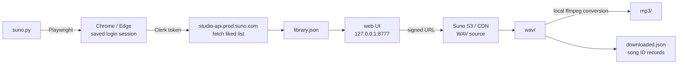

# 🎵 Suno File Downloader

**A desktop tool for backing up your Suno liked songs as WAV / MP3 files in one batch.**

Instead of downloading songs one at a time in the browser, fetch the entire list and choose what to download. Thumbnails and previews let you identify each song visually and by ear.

## Why was it made?

Suno's download policy changes on September 3, 2026.

| Plan | Monthly download limit |
|:--|--:|
| Free | 7 songs |
| **Pro** | **20 songs** |
| Premier | 60 songs |

The limit also applies retroactively to songs created before September 3. This tool was created to secure an existing library beforehand.

## ✨ Features

| Feature | Description |
|:--|:--|
| 🔐 **Automatic login** | Log in once; your session is saved for future runs. |
| 🖼 **Thumbnail list** | Select songs while viewing their cover art, including replaced covers. |
| ▶️ **Preview** | Listen before downloading; downloaded songs play instantly from local files. |
| 🔍 **Search and sort** | Search by title and sort by newest, oldest, number, or title. |
| 📦 **Selective downloads** | Select with checkboxes or choose “not downloaded yet.” |
| 🔁 **Duplicate prevention** | Downloaded songs are tracked by song ID. |
| ✏️ **Automatic renaming** | Local filenames follow title or number changes. |
| 🎛 **Automatic WAV generation** | Request conversion and download when a server WAV does not exist. |
| 🎚 **Automatic MP3 conversion** | Create 192 kbps MP3 files locally from downloaded WAVs. |
| 📥 **Import manually downloaded WAVs** | Put WAVs downloaded from Suno into the folder and the tool will identify and organize them. |
| 🧹 **Server synchronization** | Automatically remove local files for songs unliked on the server. |
| 💾 **Safe storage** | Streaming keeps memory use low, and interrupted downloads can resume safely. |

## 🚀 Quick start

### Requirements

- Windows 10/11
- **Chrome** or **Edge** (an already-installed browser is used)
- A Suno **Pro or Premier** subscription. WAV downloads are limited to paid plans, and MP3 files are created from those WAVs.

### Run

```bash
git clone https://github.com/only2433/suno_file_downloader.git
cd suno_file_downloader
```

Then double-click **`run.bat`**. Required packages are installed automatically the first time.

Python is searched for in this order: the `python` command, the `py` launcher, and standard installation paths. It can be found even if it is not on `PATH`, provided it is installed.

You can also pass commands:

```bash
run.bat sync
run.bat makewav --dry-run
```

<details>
<summary>Run without the batch file</summary>

```bash
pip install -r requirements.txt
python suno.py
```

The two installed packages are:

- **playwright** — browser automation using your installed Chrome/Edge
- **imageio-ffmpeg** — ffmpeg for converting WAV to MP3
</details>

### What happens when it runs?

With no arguments, the following steps run automatically:

```
1. Check login        Open a browser if the session is missing or expired
2. Sync library       Fetch liked songs and number them by creation date
3. Clean removed      Move unliked songs to _removed\\
4. Match names        Rename files whose title or number changed
5. Scan manual files  Organize WAVs placed in wav\\ and convert them to MP3
6. Open web UI        127.0.0.1:8777
```

The browser opens only for the initial login. Log in to Suno normally; the saved session is used automatically afterward.

### Using another PC

Numbers are calculated from creation-date order, so they remain consistent across PCs.

```
1. Copy the wav\\ and mp3\\ folders, including downloaded.json
2. Clone the repository on the new PC
3. Put the copied folders in place and run run.bat
4. Log in to Suno once when the browser opens
```

Even without `downloaded.json`, step 5 can recover songs by title and duration. Bringing it along is much faster because it avoids reconverting every MP3.

### Build an EXE (optional)

Run `build.bat` to create `SunoDownloader.exe` and an `_internal\\` folder. Copy both together to a PC without Python; they must remain in the same location.

> `_internal\\` is about 200 MB because it includes ffmpeg.

## 🖥 Web UI

The browser opens `http://127.0.0.1:8777/`.

The interface shows liked songs, local WAV/MP3 availability, search and sorting controls, selection checkboxes, previews, and a download button. The **File #** is fixed per song and is independent of the current list order. The ▶ button plays the local MP3, or the WAV when no MP3 exists.

## 📋 Commands

Use `python suno.py <command>` or `SunoDownloader.exe <command>`.

| Command | Description |
|:--|:--|
| *(none)* | Check login → sync → open UI **(normal usage)** |
| `login` | Login only · `--browser chrome\|msedge` |
| `sync` | Refresh the list and rename files to match changed titles |
| `ui` | Open the UI using the saved list · `--port 8777` |
| `makewav` | Request and download missing server WAVs · `--dry-run` |
| `scan` | Organize manually added WAVs · `--dry-run` `--no-mp3` |
| `cleanup` | Move files absent from the server list · `--dry-run` `--purge` |
| `rename` | Match filenames to changed titles · `--dry-run` |
| `get --all --format wav,mp3` | Download everything without the UI |
| `get --search "박살" --format mp3` | Download songs selected by title |

## ⚙️ How it works



The key design is separating the library list from the files. Suno's list API requires a Clerk token that lasts only 60 seconds, so the list is fetched through the browser session while audio is downloaded outside the browser. Long downloads therefore do not depend on an unexpired token.

### Duplicate detection

Each folder has a `downloaded.json` containing the downloaded **clip IDs**. Detection uses IDs rather than filenames, so renaming a file or changing its number does not trigger another download.

> ⚠️ If the actual file is deleted, it is downloaded again even when its ID remains in the record.

### WAV files are not generated in advance

Suno does not create a WAV when a song is generated. A download must be requested once, so songs never downloaded before may return `403`.

Enable **Generate WAV if missing** in the UI or use `makewav`; the request normally takes about six seconds.

### MP3 files are created from WAV

Suno blocks direct MP3 downloads (`cdn1` returns 403). The tool creates 192 kbps MP3s locally from downloaded lossless WAVs. Selecting MP3 automatically obtains the WAV first. Local conversion does not count against Suno's download limit.

See [NOTES.md](NOTES.md) for details about what is blocked and how.

### Songs removed from the server are handled automatically

Songs unliked or deleted on Suno are moved to `_removed\\` instead of being deleted immediately. This prevents old numbered files from conflicting with newly numbered songs while allowing recovery if a song was unliked accidentally. Delete that folder after checking it, or use `cleanup --purge` to remove files immediately.

If more than 10% of songs disappear from the list, automatic cleanup stops and reports the issue to prevent mass removal after an incomplete sync.

### Adding WAVs downloaded directly from Suno

After September 3, downloading manually from the Suno site is the safer option. Put the WAV in `wav\\`; the next run will find the unrecorded file, identify the song, rename it to `number - title.wav`, add it to the record, and create an MP3.

Identification is attempted in this order:

| Evidence | Description |
|:--|:--|
| Song ID in filename | Certain when the clip ID appears in the name |
| Number in filename | For example, `001 - ...` |
| Matching title | Ignores punctuation, case, and `(1)` suffixes |
| Title + duration | Distinguishes songs with the same title within ±1.5 seconds |

Ambiguous files are left untouched and the reason is reported: the title is not in the list, multiple songs have the same title and duration, or the song's WAV already exists. Use `scan --dry-run` to preview changes.

## 📁 Folder structure

```text
suno_file_downloader/
├─ NOTES.md                Technical notes (Suno API behavior and workarounds)
├─ suno.py                 Main program (login, sync, web server, CLI)
├─ download.py             Download engine (streaming, retries, records)
├─ ui.html                 Web UI
├─ run.bat                 Run and automatically install packages
├─ build.bat               Build the EXE
├─ collect.js / convert.js Legacy manual method (for console pasting)
│
├─ library.json            Liked list          ← .gitignore
├─ settings.json           Browser selection   ← .gitignore
├─ .chrome-profile/        Login session       ← .gitignore ⚠️
├─ wav/                    WAV + downloaded.json ← .gitignore
└─ mp3/                    MP3 + downloaded.json ← .gitignore
```

Filenames use `001 - song-title.wav`; numbers follow creation-date order, with the oldest song as 1. The UI defaults to newest first, so new songs appear at the top. Choose file-number sorting to view them by number.

Set the `SUNO_DATA_DIR` environment variable to change the storage location.

## ❓ Frequently asked questions

<details>
<summary><b>The browser opens and seems stuck on about:blank.</b></summary>

This is normal. Check the console for progress such as `Connecting to suno.com... (1/5)`. Suno is a large SPA, so the first connection can take a few seconds.
</details>

<details>
<summary><b>I see an “unsupported command-line flag (--no-sandbox)” warning.</b></summary>

Browser automation always adds this flag. It can be ignored.
</details>

<details>
<summary><b>It says “Python not found.”</b></summary>

Install Python from [python.org](https://www.python.org/downloads/) and check **Add python.exe to PATH**. If it is installed but still not found, disable the Microsoft Store aliases at **Settings > Apps > Advanced app settings > App execution aliases** for `python.exe`.

If Python cannot be installed on a company PC, copy `SunoDownloader.exe` and `_internal\\` built with `build.bat` from another PC.
</details>

<details>
<summary><b>I want to use Edge.</b></summary>

```bash
python suno.py login --browser msedge
```

After a successful login, the choice is saved in `settings.json`. Profiles are stored separately per browser, so switching browsers requires one more login.
</details>

<details>
<summary><b>WAV downloads fail with 403.</b></summary>

The server has not generated a WAV for that song yet. Enable **Generate WAV if missing** or use `makewav`. WAV is limited to **Pro / Premier**, and an active subscription is also required to create MP3s from it.
</details>

<details>
<summary><b>I want to use it on another PC.</b></summary>

Clone the repository, run `pip install -r requirements.txt`, and start it. Login is required once per PC; sessions are never committed. Copy the audio folders too so `downloaded.json` lets the tool skip existing downloads.
</details>

<details>
<summary><b>It is too slow or gets blocked.</b></summary>

Server checks are intentionally slow. Too many concurrent requests can cause false `403` errors for valid files. When using `download.py` directly, lower concurrency to around `--workers 2`.
</details>

## ⚠️ Important notes

- This tool is intended to back up your own songs from your own account.
- **Generate WAV if missing is disabled by default from September 3.** The request behaves like clicking Suno's download button and may count toward the monthly limit. Manually download from Suno and place the file in `wav\\` instead.
- Creating MP3s locally from existing WAVs is unrelated to the download limit. Keeping downloaded files is safest.
- Downloads stream in 64 KB chunks, so memory use stays constant regardless of song size or count.
- In-progress files use a `.part` extension and are renamed only after completion, so interrupted downloads do not leave corrupt final files.
- Each song is retried up to four times after failure.

## 🔗 References

- [NOTES.md](NOTES.md) — Suno API behavior and limitations
- [Suno Help — WAV downloads](https://help.suno.com/en/articles/2479873)
- [Suno policy update](https://suno.com/blog/suno-updates-tos)

---

<sub>A personal utility. This is an unofficial project unrelated to Suno.</sub>
