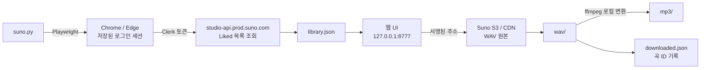

# 🎵 Suno File Downloader

**Suno에서 좋아요(Liked)한 곡을 WAV / MP3로 한 번에 백업하는 데스크톱 도구**

브라우저에서 곡을 하나씩 눌러 받는 대신, 목록을 통째로 가져와 원하는 것만 골라 받습니다.
썸네일과 미리듣기가 있어 무엇을 받는지 눈으로 확인하면서 고를 수 있습니다.

<br>

## 왜 만들었나

2026년 9월 3일부터 Suno의 다운로드 정책이 바뀝니다.

| 플랜 | 월 다운로드 한도 |
|:--|--:|
| Free | 7곡 |
| **Pro** | **20곡** |
| Premier | 60곡 |

이 제한은 **9월 3일 이전에 만든 곡에도 소급 적용**됩니다.
그 전에 기존 라이브러리를 통째로 확보해 두려고 만들었습니다.

<br>

## ✨ 주요 기능

| 기능 | 설명 |
|:--|:--|
| 🔐 **자동 로그인** | 최초 1회만 로그인하면 세션이 저장되어 이후 자동 |
| 🖼 **썸네일 목록** | 커버 아트를 보면서 선택 (교체한 커버도 그대로 반영) |
| ▶️ **미리듣기** | 받기 전에 들어볼 수 있음 · 받아둔 곡은 로컬 파일로 즉시 재생 |
| 🔍 **검색 · 정렬** | 제목 검색, 최신순/오래된순/번호순/제목순 |
| 📦 **선택 다운로드** | 체크박스로 고르거나 "아직 안 받은 것만" 한 번에 |
| 🔁 **중복 방지** | 곡 ID로 기록해 이미 받은 곡은 건너뜀 |
| ✏️ **이름 자동 정리** | 제목이 바뀌거나 번호가 달라지면 로컬 파일명도 따라 변경 |
| 🎛 **WAV 자동 생성** | 서버에 WAV가 없으면 변환을 요청한 뒤 받음 |
| 🎚 **MP3 자동 변환** | 받아둔 WAV에서 192kbps MP3를 만듦 (Suno 서버를 거치지 않음) |
| 📥 **수동 WAV 받아들이기** | Suno에서 직접 받은 WAV를 폴더에 넣어두면 곡을 찾아 정리 |
| 🧹 **서버와 동기화** | 좋아요를 해제한 곡의 로컬 파일을 자동으로 치움 |
| 💾 **안전한 저장** | 스트리밍 방식이라 메모리 부담 없음 · 중단해도 이어받기 |

<br>

## 🚀 빠른 시작

### 준비물

- Windows 10/11
- **Chrome** 또는 **Edge** (이미 설치된 브라우저를 사용합니다)
- Suno **Pro 또는 Premier** 구독 — WAV가 유료 플랜 전용이고,
  MP3도 그 WAV에서 만들기 때문에 구독이 필요합니다

### 실행

```bash
git clone https://github.com/only2433/suno_file_downloader.git
cd suno_file_downloader
```

그리고 **`run.bat` 을 더블클릭**하세요. 끝입니다.

처음 한 번은 필요한 패키지를 자동으로 설치하고, 그 다음부터는 바로 실행됩니다.
Python이 없으면 어디서 받는지 알려 줍니다.

명령을 붙여서 쓸 수도 있습니다.

```bash
run.bat sync
run.bat makewav --dry-run
```

<details>
<summary>배치 파일 없이 직접 실행하려면</summary>

<br>

```bash
pip install -r requirements.txt
python suno.py
```

설치되는 것은 두 가지입니다.

- **playwright** — 브라우저 자동화 (별도 브라우저를 받지 않고 설치된 Chrome/Edge 사용)
- **imageio-ffmpeg** — WAV를 MP3로 변환할 때 쓰는 ffmpeg
</details>

### 실행하면 벌어지는 일

인자 없이 실행하면 아래가 순서대로 자동으로 돕니다.

```
1. 로그인 확인       세션이 없거나 만료면 브라우저를 띄움
2. 목록 동기화       Liked 곡을 받아 번호를 만든 날짜 순으로 매김
3. 사라진 곡 치우기   좋아요 해제한 곡의 파일을 _removed\ 로
4. 이름 맞추기       제목·번호가 바뀐 파일을 새 이름으로
5. 수동 파일 받기     wav\ 에 직접 넣어둔 파일을 정리하고 MP3 변환
6. 웹 UI 열기        127.0.0.1:8777
```

최초 1회만 브라우저 창이 열립니다. 평소처럼 Suno에 로그인하면 세션이 저장되어
다음부터는 자동입니다.

### 다른 PC에서 쓰기

번호가 만든 날짜 순위로 계산되므로 **어느 PC에서든 같은 번호**가 나옵니다.
음원만 옮기면 나머지는 저절로 맞습니다.

```
1. wav\ 와 mp3\ 폴더를 통째로 복사   ← downloaded.json 도 함께
2. 새 PC에서  git clone
3. 복사해온 폴더를 넣고  run.bat 실행
4. 브라우저가 뜨면 Suno 로그인 (그 PC에서 1회)
```

`downloaded.json` 을 빠뜨려도 5단계가 제목과 길이로 곡을 찾아 복구합니다.
다만 MP3를 전부 다시 변환하므로 함께 옮기는 편이 훨씬 빠릅니다.

### exe로 만들기 (선택)

Python이 없는 PC에서도 쓰고 싶다면 `build.bat` 을 실행하세요.
`SunoDownloader.exe` 와 `_internal\` 폴더가 만들어집니다. 이 둘을 함께 복사해 두면
Python 없이 더블클릭만으로 돌아갑니다. (항상 같은 위치에 두어야 합니다.)

> ffmpeg까지 넣기 때문에 `_internal\` 이 약 200MB 입니다.

<br>

## 🖥 웹 UI

실행하면 브라우저에 `http://127.0.0.1:8777/` 이 열립니다.

```
┌──────────────────────────────────────────────────────────────┐
│  Suno 다운로더    Liked 774곡 · 받아둔 것 WAV 743 / MP3 743   │
├──────────────────────────────────────────────────────────────┤
│  [제목 검색...]  [최신순 ▾] [전체선택] [해제] [안 받은 것만]  │
│  0곡 선택  ☑WAV ☐MP3 ☑없으면 WAV 생성 ☑untitled 숨기기       │
│                                        [ 다운로드 시작 ]      │
├──────────────────────────────────────────────────────────────┤
│ ☐ ▶ [🖼]  766  YOU DID THAT (Feat. B-Pie)   3:11  받음  받음 │
│ ☐ ▶ [🖼]    1  Best Day Today               3:25  받음  받음 │
│ ☐ ▶ [🖼]    2  Walking on Light             4:08  받음  받음 │
└──────────────────────────────────────────────────────────────┘
```

- **WAV / MP3 열** — 내 PC에 이미 받아둔 파일이 있는지 (`받음` / `미보유`)
- **파일 #** — 파일명 앞에 붙는 번호. 곡마다 고정되며 목록 순서와 무관합니다
- **▶ 버튼** — 미리듣기. 받아둔 파일로 재생합니다 (MP3가 없으면 WAV로)

<br>

## 📋 명령어

`python suno.py <명령>` 또는 `SunoDownloader.exe <명령>`

| 명령 | 설명 |
|:--|:--|
| *(없음)* | 로그인 확인 → 동기화 → UI **(평소엔 이것만)** |
| `login` | 로그인만 · `--browser chrome\|msedge` |
| `sync` | 목록 새로 가져오기 + 바뀐 제목에 맞춰 파일명 정리 |
| `ui` | 저장된 목록으로 UI만 열기 · `--port 8777` |
| `makewav` | 서버에 WAV가 없는 곡의 변환 요청 후 다운로드 · `--dry-run` |
| `scan` | 직접 넣은 WAV를 정리 (실행 시 자동) · `--dry-run` `--no-mp3` |
| `cleanup` | 서버 목록에 없는 파일 치우기 (실행 시 자동) · `--dry-run` `--purge` |
| `rename` | 제목이 바뀐 곡의 파일명 맞추기 · `--dry-run` |
| `get --all --format wav,mp3` | UI 없이 전부 받기 |
| `get --search "박살" --format mp3` | 제목으로 골라 받기 |

<br>

## ⚙️ 동작 원리



핵심은 **목록과 파일을 분리**한 점입니다.

Suno의 목록 API는 Clerk 토큰이 필요한데, 이 토큰은 **수명이 60초**입니다.
그래서 목록만 브라우저 세션으로 가져오고, 실제 오디오는 브라우저 밖에서
받습니다. 덕분에 긴 다운로드 중에 토큰이 만료될 걱정이 없습니다.

### 중복을 판단하는 방법

각 폴더의 `downloaded.json` 에 받은 곡의 **clip ID**를 기록합니다.
파일명이 아니라 ID로 판단하므로, 파일 이름을 바꾸거나 번호가 달라져도
다시 받지 않습니다.

> ⚠️ 단, **파일을 지우면 다시 받습니다.** 기록에 있어도 실물이 없으면
> "지워졌으니 복구"로 봅니다.

### WAV는 미리 만들어져 있지 않습니다

Suno는 곡을 만들 때 WAV를 생성해 두지 않습니다. **누군가 다운로드를 한 번
눌러야** 그때 변환됩니다. 그래서 한 번도 받은 적 없는 곡은 `403` 이 돌아옵니다.

UI의 **"없으면 WAV 생성"** 체크박스를 켜면 변환을 요청한 뒤(보통 6초) 자동으로
받습니다. `makewav` 명령도 같은 일을 합니다.

### MP3는 받지 않고 WAV에서 만듭니다

Suno가 MP3 직접 내려받기를 막았습니다(`cdn1` 403). 그래서 MP3는 서버에서 받지
않고, 받아둔 **무손실 WAV에서 ffmpeg으로 192kbps MP3를 만듭니다.**

MP3만 선택해도 알아서 WAV를 먼저 확보한 뒤 변환합니다. 변환은 로컬 작업이라
**Suno의 다운로드 한도와 무관합니다.**

무엇이 어떻게 막혔는지는 [NOTES.md](NOTES.md)에 정리해 두었습니다.

### 서버에서 사라진 곡은 자동으로 치웁니다

좋아요를 해제하거나 Suno에서 지운 곡은 로컬 파일도 함께 정리됩니다.
그냥 두면 옛 번호를 단 채 남아 새로 번호를 받은 곡과 이름이 부딪힙니다.

**바로 지우지 않고 `_removed\` 폴더로 옮깁니다.** 9월 3일 이후로는 다시 받기
어려우니, 실수로 좋아요를 해제했더라도 되돌릴 수 있게 했습니다. 확인 후
필요 없으면 그 폴더를 지우세요. 바로 지우려면 `cleanup --purge`.

> 목록에서 사라진 곡이 전체의 10%를 넘으면 자동 정리를 멈추고 알려줍니다.
> 동기화가 잘못돼 목록이 반쪽만 왔을 때 파일을 무더기로 치우는 사고를 막습니다.

### Suno에서 직접 받은 WAV 넣기

9월 3일 이후로는 Suno 사이트에서 손으로 받는 편이 안전합니다.
받은 WAV를 그냥 **`wav\` 폴더에 넣어두면** 됩니다. 다음 실행 때 자동으로:

1. 기록에 없는 파일을 찾아내고
2. 그게 어느 곡인지 알아내서
3. `번호 - 곡이름.wav` 로 이름을 바꾸고
4. 기록에 넣은 뒤
5. MP3까지 만듭니다

곡을 찾는 방법은 네 가지이고, 확실한 순서대로 시도합니다.

| 근거 | 설명 |
|:--|:--|
| 파일명의 곡 ID | 이름에 clip ID가 들어 있으면 확실 |
| 파일명의 번호 | `001 - ...` 형태 |
| 제목 일치 | 문장부호·대소문자·`(1)` 꼬리표 차이는 무시 |
| 제목 + 길이 | 같은 제목의 곡이 여럿일 때 재생 길이로 구분 (±1.5초) |

**가릴 수 없으면 손대지 않고 이유를 알려줍니다.** 목록에 없는 제목이거나,
같은 제목·같은 길이의 곡이 둘 이상이거나, 그 곡의 WAV를 이미 갖고 있는 경우입니다.

미리 확인만 하려면 `scan --dry-run` 을 쓰세요.

<br>

## 📁 폴더 구조

```
suno_file_downloader/
├─ NOTES.md                기술 노트 (Suno API 동작 · 우회 방법)
├─ suno.py                 메인 (로그인 · 동기화 · 웹서버 · CLI)
├─ download.py             다운로드 엔진 (스트리밍 · 재시도 · 기록)
├─ ui.html                 웹 UI
├─ run.bat                 실행 (패키지 자동 설치 후 시작)
├─ build.bat               exe 빌드
├─ collect.js / convert.js 예전 수동 방식 (콘솔 붙여넣기용)
│
├─ library.json            Liked 목록          ← .gitignore
├─ settings.json           브라우저 선택 등     ← .gitignore
├─ .chrome-profile/        로그인 세션          ← .gitignore ⚠️
├─ wav/                    WAV + downloaded.json ← .gitignore
└─ mp3/                    MP3 + downloaded.json ← .gitignore
```

파일명은 `001 - 곡제목.wav` 형식이고, **번호는 만든 날짜 순서**입니다.
가장 오래된 곡이 1번, 최신곡이 가장 큰 번호를 받습니다.

웹 UI는 기본이 최신순이라 **새 곡이 맨 위**에 옵니다. 번호순으로 보려면
정렬을 `파일번호순`으로 바꾸세요.

저장 위치를 바꾸려면 환경변수 `SUNO_DATA_DIR` 을 지정하세요.

<br>

## ❓ 자주 묻는 질문

<details>
<summary><b>브라우저가 뜨고 about:blank 에서 멈춘 것 같아요</b></summary>

<br>

정상입니다. 콘솔에 `suno.com 접속 중... (1/5)` 처럼 진행 상황이 표시되니
그걸 보시면 됩니다. Suno는 무거운 SPA라 첫 접속이 몇 초 걸립니다.
</details>

<details>
<summary><b>"지원되지 않는 명령줄 플래그(--no-sandbox)" 경고가 떠요</b></summary>

<br>

브라우저 자동화 도구가 항상 붙이는 플래그입니다. 무시하셔도 됩니다.
</details>

<details>
<summary><b>Edge로 쓰고 싶어요</b></summary>

<br>

```bash
python suno.py login --browser msedge
```

성공하면 `settings.json` 에 기록되어 다음부터는 자동으로 Edge를 씁니다.
프로필은 브라우저마다 따로 보관되므로, 바꾸면 한 번 다시 로그인해야 합니다.
</details>

<details>
<summary><b>WAV가 403으로 실패해요</b></summary>

<br>

그 곡은 서버에 WAV가 아직 만들어지지 않았습니다.
UI의 **"없으면 WAV 생성"** 을 켜거나 `makewav` 명령을 쓰세요.

WAV 자체는 **Pro / Premier 전용**입니다. MP3도 이 WAV에서 만들므로 구독이 필요합니다.
</details>

<details>
<summary><b>다른 PC에서도 쓰고 싶어요</b></summary>

<br>

저장소를 clone 하고 `pip install -r requirements.txt` 후 실행하면 됩니다.
로그인은 PC마다 한 번씩 해야 합니다 (세션은 커밋되지 않습니다).

기존 음원 폴더를 함께 옮기면 `downloaded.json` 덕분에 이미 받은 곡은
건너뜁니다.
</details>

<details>
<summary><b>속도가 너무 느리거나 차단돼요</b></summary>

<br>

서버 상태 확인은 일부러 천천히 합니다. 동시 요청을 많이 보내면 정상 파일까지
`403` 으로 오탐이 납니다. `download.py` 를 직접 쓸 때는 `--workers 2` 정도로
낮추세요.
</details>

<br>

## ⚠️ 알아둘 점

- 이 도구는 **본인 계정의 본인 곡**을 백업하기 위한 것입니다.
- **"없으면 WAV 생성"은 9월 3일부터 기본으로 꺼집니다.** 변환 요청은 Suno에서
  다운로드 버튼을 누르는 것과 같은 동작이라 월 한도에 포함될 수 있습니다.
  그 이후로는 Suno 사이트에서 직접 받아 `wav\` 폴더에 넣는 편이 안전합니다.
- 반면 **받아둔 WAV에서 MP3를 만드는 것은 로컬 작업**이라 한도와 무관합니다.
  받아둔 파일을 지우지 않는 편이 안전합니다.
- 다운로드는 64KB씩 스트리밍합니다. 곡 크기나 개수와 무관하게 메모리
  사용량이 일정합니다.
- 받는 중인 파일은 `.part` 로 쓰다가 완료 시에만 이름이 바뀝니다.
  중단해도 깨진 파일이 남지 않습니다.
- 실패 시 곡당 4회까지 재시도합니다.

<br>

## 🔗 참고

- [NOTES.md](NOTES.md) — Suno API가 어떻게 동작하고 무엇이 막혔는지
- [Suno 도움말 — WAV 다운로드](https://help.suno.com/en/articles/2479873)
- [Suno 정책 변경 공지](https://suno.com/blog/suno-updates-tos)

<br>

---

<sub>개인용으로 만든 도구입니다. Suno와 무관한 비공식 프로젝트입니다.</sub>
